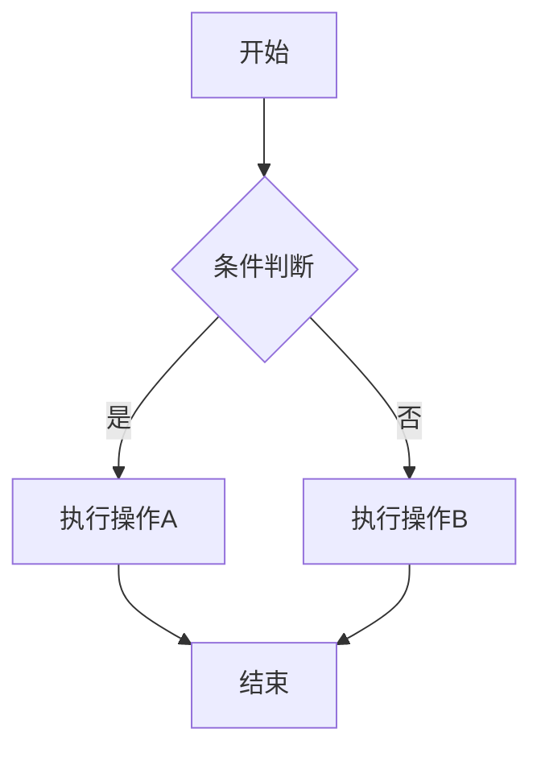
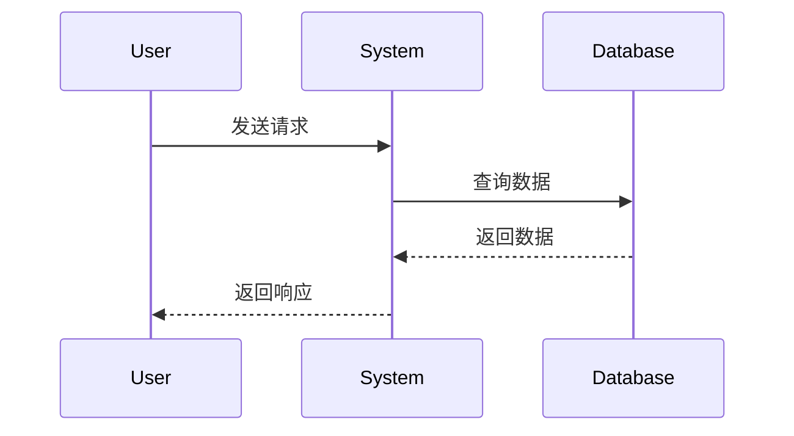
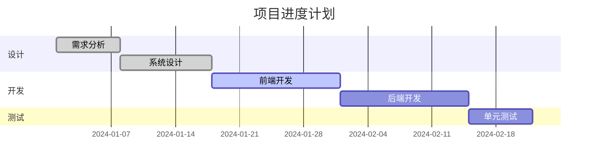

# 欢迎使用 MdReader

## 1. 流程图

```mermaid
graph TD;
    A[开始] --> B{条件判断};
    B -->|是| C[执行操作A];
    B -->|否| D[执行操作B];
    C --> E[结束];
    D --> E;
```

## 2. 时序图

```mermaid
sequenceDiagram;
    participant 用户 as User
    participant 系统 as System
    participant 数据库 as Database
    
    用户->>系统: 发送请求
    系统->>数据库: 查询数据
    数据库-->>系统: 返回数据
    系统-->>用户: 返回响应
```
## 3. 甘特图

```mermaid
gantt
    title 项目进度计划
    dateFormat  YYYY-MM-DD
    section 设计
    需求分析     :done, des1, 2024-01-01, 7d
    系统设计     :done, des2, after des1, 10d
    section 开发
    前端开发     :active, dev1, 2024-01-18, 14d
    后端开发     :dev2, after dev1, 14d
    section 测试
    单元测试     :test1, after dev2, 7d
```

**预期结果**:
- 三个 Mermaid 图表都应正确渲染
- 流程图显示节点和连接线
- 时序图显示参与者和消息箭头
- 甘特图显示时间轴和进度条

---